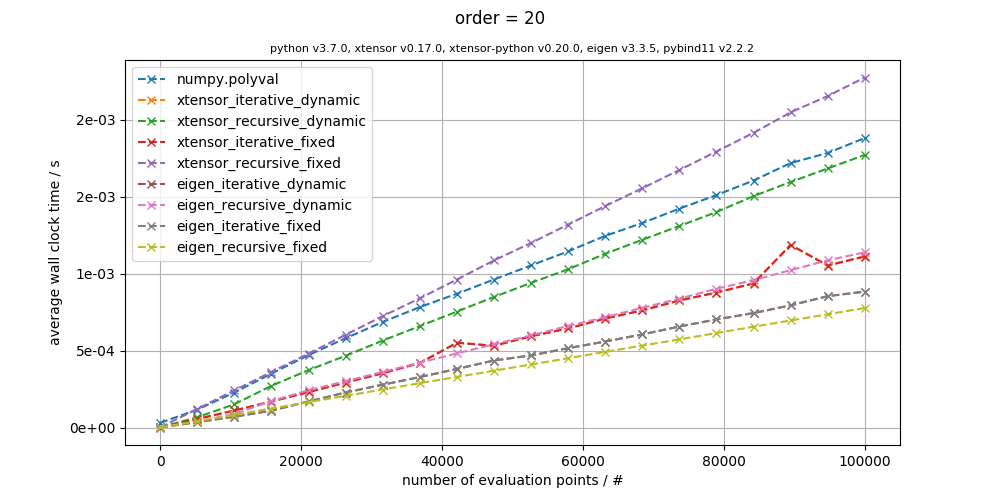
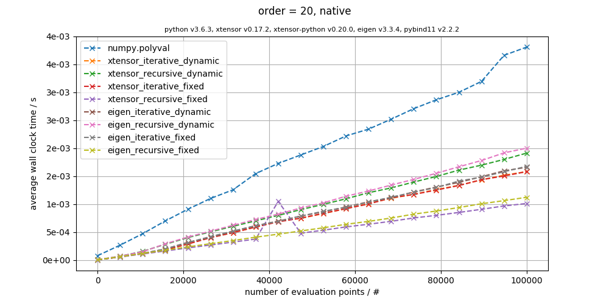

<!-- markdown-toc start - Don't edit this section. Run M-x markdown-toc-refresh-toc -->
**Table of Contents**

- [Introduction](#introduction)
- [Run the Benchmark](#run-the-benchmark)
- [Benchmark Results](#benchmark-results)
    - [i7 4770k](#i7-4770k)
        - [GCC 8.2.0](#gcc-820)
            - [`USE_LAMBDA_XFUNCTION = ON`](#use_lambda_xfunction--on)
            - [`USE_LAMBDA_XFUNCTION = OFF`](#use_lambda_xfunction--off)
        - [Clang 6.0.1](#clang-601)
            - [`USE_LAMBDA_XFUNCTION = ON`](#use_lambda_xfunction--on-1)
            - [`USE_LAMBDA_XFUNCTION = OFF`](#use_lambda_xfunction--off-1)
    - [i5 4300u](#i5-4300u)
        - [GCC 8.2.0](#gcc-820-1)
            - [`USE_LAMBDA_XFUNCTION = ON`](#use_lambda_xfunction--on-2)
            - [`USE_LAMBDA_XFUNCTION = OFF`](#use_lambda_xfunction--off-2)
        - [Clang 6.0.1](#clang-601-1)
            - [`USE_LAMBDA_XFUNCTION = ON`](#use_lambda_xfunction--on-3)
            - [`USE_LAMBDA_XFUNCTION = OFF`](#use_lambda_xfunction--off-3)
    - [Xeon W3670](#xeon-w3670)
        - [GCC 8.2.0](#gcc-820-2)
            - [`USE_LAMBDA_XFUNCTION = ON`](#use_lambda_xfunction--on-4)
            - [`USE_LAMBDA_XFUNCTION = OFF`](#use_lambda_xfunction--off-4)
        - [Clang 6.0.1](#clang-601-2)
            - [`USE_LAMBDA_XFUNCTION = ON`](#use_lambda_xfunction--on-5)
            - [`USE_LAMBDA_XFUNCTION = OFF`](#use_lambda_xfunction--off-5)
    - [Armv7-a](#armv7_a)
        - [GCC 8.1.0](#gcc-810)
            - [`USE_LAMBDA_XFUNCTION = ON`](#use_lambda_xfunction--on-6)
            - [`USE_LAMBDA_XFUNCTION = OFF`](#use_lambda_xfunction--off-6)
- [Contributing](#contributing)

<!-- markdown-toc end -->

# Introduction
This benchmark compares the execution time of the Horner scheme algorithm for univariate polynomial evaluation, implemented with popular expression template libraries in C++, that have been made accessible in python through the use of [pybind11](https://github.com/pybind/pybind11).

The libraries that are currently available in the benchmark are

- [NumPy](https://www.scipy.org/scipylib/download.html) (reference, numpy.polyval)
- [xtensor](https://github.com/QuantStack/xtensor)
- [Eigen](http://eigen.tuxfamily.org/index.php?title=Main_Page)

We use `iterative` and `recursive` Horner algorithms as well as `dynamic` and `fixed` size polynomials.
The `fixed recursive` versions are of special interest since they heavily exploit the expression template nature of the aforementioned libraries through the use of *TMP* and *auto return type deduction*. However, those fixed size polynomials may not be applicable to most problems, therefore we also supply dynamic versions which accept arbitrary number of coefficients (order).

# Run the Benchmark
In order to be able to run this benchmark on your PC you need to have the following libraries installed

**C++:**
- [xtl](https://github.com/QuantStack/xtl)
- [xsimd](https://github.com/QuantStack/xsimd)
- [xtensor](https://github.com/QuantStack/xtensor)
- [xtensor-python](https://github.com/QuantStack/xtensor-python)
- [Eigen](http://eigen.tuxfamily.org/index.php?title=Main_Page)
- [pybind11](https://github.com/pybind/pybind11)
- [NumPy](https://www.scipy.org/scipylib/download.html)

You also need [Python 3.x](https://www.python.org/downloads/) with the following libraries

**Python:**
- [NumPy](https://www.scipy.org/scipylib/download.html)
- [Matplotlib](https://matplotlib.org/users/installing.html)

With these libraries installed you can simply run

```bash
git clone https://github.com/BeneSim/polynomial_benchmark.git
cd polynomial_benchmark
mkdir build
cd build
cmake  -DCMAKE_PREFIX_PATH="\
/path/to/xtl/installation/root;\
/path/to/xsimd/installation/root;\
/path/to/xtensor/installation/root;\
/path/to/xtensor-python/installation/root;\
/path/to/Eigen/installation/root;\
/path/to/pybind11/installation/root" \
-DCMAKE_MODULE_PATH="/path/to/xtensor-python/src/cmake" \
-DCMAKE_BUILD_TYPE=Release ..
cmake --build . --target benchmark
```

You can of course omit the `-DCMAKE_PREFIX_PATH` stuff if you've installed the libraries in paths that CMake is aware of. [xtensor-python](https://github.com/QuantStack/xtensor-python) ships with a [FindNumPy.cmake](https://github.com/QuantStack/xtensor-python/blob/master/cmake/FindNumPy.cmake) module in the src/cmake folder.

There are 3 additional options that you can set (using `cmake -DOPTION_NAME=VALUE` or other tools like `ccmake`)

- `USE_MARCH_NATIVE=[ON/OFF]` Compiles the python bindings with `-march=native`
- `USE_XSIMD=[ON/OFF]` Enables `xsimd` support
- `USE_LAMBDA_XFUNCTION` Uses an alternative approach for the fixed recursive Horner scheme (suggested by [@wolfv](https://github.com/wolfv))

If you want to run every combination, e.g. if you want to contribute to the benchmark results, you may want to use a simple bash script like this one

```bash
#!/bin/bash
for USE_MARCH_NATIVE in ON OFF
do
  for USE_XSIMD in ON OFF
  do
    for USE_LAMBDA_XFUNCTION in ON OFF
    do
      cmake -DUSE_MARCH_NATIVE=$USE_MARCH_NATIVE -DUSE_XSIMD=$USE_XSIMD -DUSE_LAMBDA_XFUNCTION=$USE_LAMBDA_XFUNCTION ..
      cmake --build . --target benchmark
    done
  done
done
```

**Warning:** Running all combinations will approximately take 30 minutes!

# Benchmark Results
Here are some benchmarks for various CPUs, only the `order = 20` benchmarks will be presented. The complete set of benchmarks can be found in [benchmarks](benchmarks).

## i7 4770k
### GCC 8.2.0
#### `USE_LAMBDA_XFUNCTION = ON`

[](benchmarks/i7_4770k/gcc_8.2.0/lambda_20_xsimd_native.png)
[](benchmarks/i7_4770k/gcc_8.2.0/lambda_20_native.png)
[](benchmarks/i7_4770k/gcc_8.2.0/lambda_20_xsimd.png)
[](benchmarks/i7_4770k/gcc_8.2.0/lambda_20.png)

#### `USE_LAMBDA_XFUNCTION = OFF`

[](benchmarks/i7_4770k/gcc_8.2.0/20_xsimd_native.png)
[](benchmarks/i7_4770k/gcc_8.2.0/20_native.png)
[](benchmarks/i7_4770k/gcc_8.2.0/20_xsimd.png)
[](benchmarks/i7_4770k/gcc_8.2.0/20.png)

### Clang 6.0.1
#### `USE_LAMBDA_XFUNCTION = ON`

[](benchmarks/i7_4770k/clang_6.0.1/lambda_20_xsimd_native.png)
[](benchmarks/i7_4770k/clang_6.0.1/lambda_20_native.png)
[](benchmarks/i7_4770k/clang_6.0.1/lambda_20_xsimd.png)
[](benchmarks/i7_4770k/clang_6.0.1/lambda_20.png)

#### `USE_LAMBDA_XFUNCTION = OFF`

[](benchmarks/i7_4770k/clang_6.0.1/20_xsimd_native.png)
[](benchmarks/i7_4770k/clang_6.0.1/20_native.png)
[](benchmarks/i7_4770k/clang_6.0.1/20_xsimd.png)
[](benchmarks/i7_4770k/clang_6.0.1/20.png)

## i5 4300u
### GCC 8.2.0
#### `USE_LAMBDA_XFUNCTION = ON`

[](benchmarks/i5_4300u/gcc_8.2.0/lambda_20_xsimd_native.png)
[](benchmarks/i5_4300u/gcc_8.2.0/lambda_20_native.png)
[](benchmarks/i5_4300u/gcc_8.2.0/lambda_20_xsimd.png)
[](benchmarks/i5_4300u/gcc_8.2.0/lambda_20.png)

#### `USE_LAMBDA_XFUNCTION = OFF`

[](benchmarks/i5_4300u/gcc_8.2.0/20_xsimd_native.png)
[](benchmarks/i5_4300u/gcc_8.2.0/20_native.png)
[](benchmarks/i5_4300u/gcc_8.2.0/20_xsimd.png)
[](benchmarks/i5_4300u/gcc_8.2.0/20.png)

### Clang 6.0.1
#### `USE_LAMBDA_XFUNCTION = ON`

[](benchmarks/i5_4300u/clang_6.0.1/lambda_20_xsimd_native.png)
[](benchmarks/i5_4300u/clang_6.0.1/lambda_20_native.png)
[](benchmarks/i5_4300u/clang_6.0.1/lambda_20_xsimd.png)
[](benchmarks/i5_4300u/clang_6.0.1/lambda_20.png)

#### `USE_LAMBDA_XFUNCTION = OFF`

[](benchmarks/i5_4300u/clang_6.0.1/20_xsimd_native.png)
[](benchmarks/i5_4300u/clang_6.0.1/20_native.png)
[](benchmarks/i5_4300u/clang_6.0.1/20_xsimd.png)
[](benchmarks/i5_4300u/clang_6.0.1/20.png)

## Xeon W3670
### GCC 8.2.0
#### `USE_LAMBDA_XFUNCTION = ON`

[](benchmarks/xeon_w3670/gcc_8.2.0/lambda_20_xsimd_native.png)
[](benchmarks/xeon_w3670/gcc_8.2.0/lambda_20_native.png)
[](benchmarks/xeon_w3670/gcc_8.2.0/lambda_20_xsimd.png)
[](benchmarks/xeon_w3670/gcc_8.2.0/lambda_20.png)

#### `USE_LAMBDA_XFUNCTION = OFF`

[](benchmarks/xeon_w3670/gcc_8.2.0/20_xsimd_native.png)
[](benchmarks/xeon_w3670/gcc_8.2.0/20_native.png)
[](benchmarks/xeon_w3670/gcc_8.2.0/20_xsimd.png)
[](benchmarks/xeon_w3670/gcc_8.2.0/20.png)

### Clang 6.0.1
#### `USE_LAMBDA_XFUNCTION = ON`

[](benchmarks/xeon_w3670/clang_7.0.0/lambda_20_xsimd_native.png)
[](benchmarks/xeon_w3670/clang_7.0.0/lambda_20_native.png)
[](benchmarks/xeon_w3670/clang_7.0.0/lambda_20_xsimd.png)
[](benchmarks/xeon_w3670/clang_7.0.0/lambda_20.png)

#### `USE_LAMBDA_XFUNCTION = OFF`

[](benchmarks/xeon_w3670/clang_7.0.0/20_xsimd_native.png)
[](benchmarks/xeon_w3670/clang_7.0.0/20_native.png)
[](benchmarks/xeon_w3670/clang_7.0.0/20_xsimd.png)
[](benchmarks/xeon_w3670/clang_7.0.0/20.png)

## Armv7-a (RK3288 - Asus Tinkerboard) 
### GCC 8.1.0
#### `USE_LAMBDA_XFUNCTION = ON`

[](benchmarks/armv7-a/gcc_8.1.0/lambda_20_xsimd_native.png)
[](benchmarks/armv7-a/gcc_8.1.0/lambda_20_native.png)
[](benchmarks/armv7-a/gcc_8.1.0/lambda_20_xsimd.png)
[](benchmarks/armv7-a/gcc_8.1.0/lambda_20.png)

#### `USE_LAMBDA_XFUNCTION = OFF`

[](benchmarks/armv7-a/gcc_8.1.0/20_xsimd_native.png)
[](benchmarks/armv7-a/gcc_8.1.0/20_native.png)
[](benchmarks/armv7-a/gcc_8.1.0/20_xsimd.png)
[](benchmarks/armv7-a/gcc_8.1.0/20.png)

# Contributing
If you'd like to contribute with benchmark results on different CPUs feel free to add a PR. Please make sure to run all combinations of compile options as demonstrated in [Run the Benchmark](#run-the-benchmark).
